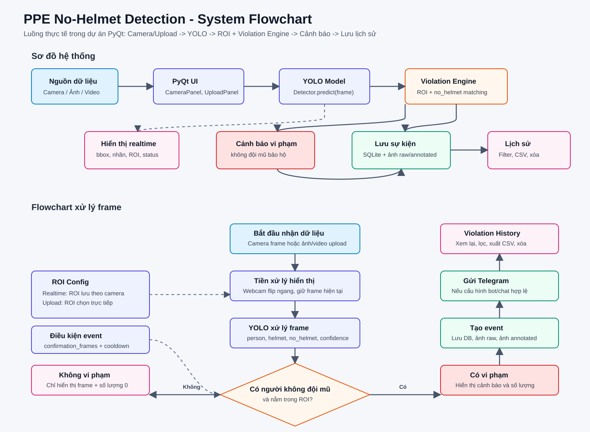

# Báo cáo luồng hoạt động hệ thống phát hiện người không đội mũ bảo hộ

## 1. Giới thiệu

Hệ thống **PPE No-Helmet Realtime Detection** được xây dựng nhằm phát hiện người lao động không đội mũ bảo hộ trong khu vực giám sát. Ứng dụng sử dụng mô hình YOLO để xử lý hình ảnh từ camera realtime hoặc từ ảnh/video upload, sau đó hiển thị cảnh báo, lưu lịch sử vi phạm và hỗ trợ xem lại dữ liệu.

## 2. Mục tiêu hệ thống

- Nhận dữ liệu từ camera, ảnh hoặc video.
- Phát hiện đối tượng người và trạng thái không đội mũ bảo hộ.
- Kiểm tra vi phạm trong vùng ROI được cấu hình.
- Hiển thị kết quả phát hiện trực tiếp trên giao diện.
- Lưu sự kiện vi phạm vào cơ sở dữ liệu SQLite.
- Lưu ảnh gốc và ảnh đã phân tích.
- Hỗ trợ xem lịch sử, lọc dữ liệu, xuất CSV và xóa sự kiện.

## 3. Thành phần chính trong dự án

| Thành phần | File | Chức năng |
|---|---|---|
| Giao diện chính | `app/gui/main_window.py` | Khởi tạo toàn bộ context, tab chức năng và giao diện chính |
| Camera realtime | `app/gui/camera_panel.py` | Nhận frame từ webcam/camera, xử lý realtime |
| Upload ảnh/video | `app/gui/upload_panel.py` | Đọc ảnh/video, chọn ROI riêng và phân tích frame |
| Cấu hình ROI | `app/gui/roi_editor.py` | Chọn và lưu ROI cho camera |
| YOLO detector | `app/core/detector.py` | Chạy mô hình YOLO để phát hiện object |
| Xử lý vi phạm | `app/core/violation_engine.py` | Kiểm tra người không đội mũ trong ROI |
| Quản lý sự kiện | `app/core/event_manager.py` | Tạo event, lưu ảnh, gửi Telegram |
| Cơ sở dữ liệu | `app/core/database.py` | Lưu camera, ROI, lịch sử vi phạm |
| Lịch sử vi phạm | `app/gui/history_panel.py` | Hiển thị, lọc, xuất CSV và xóa event |

## 4. Luồng hoạt động tổng quát

Hệ thống hoạt động theo luồng chính sau:

1. Camera hoặc ảnh/video upload cung cấp frame đầu vào.
2. Frame được đưa vào mô hình YOLO để phát hiện các đối tượng như `person`, `helmet`, `no_helmet`.
3. Kết quả phát hiện được chuyển sang `ViolationEngine`.
4. Hệ thống kiểm tra người có nằm trong ROI hay không.
5. Nếu phát hiện người không đội mũ trong ROI, hệ thống xác định đây là vi phạm.
6. Giao diện hiển thị bounding box, nhãn đối tượng, vùng ROI và trạng thái cảnh báo.
7. Nếu vi phạm đủ điều kiện tạo sự kiện, hệ thống lưu event vào database.
8. Ảnh gốc và ảnh đã phân tích được lưu vào thư mục `outputs/events`.
9. Nếu cấu hình Telegram hợp lệ, hệ thống gửi cảnh báo kèm ảnh.
10. Người dùng có thể xem lại vi phạm tại trang `Violation History`.

## 5. Sơ đồ hệ thống



## 6. Mô tả chi tiết luồng xử lý realtime camera

### 6.1. Nhận dữ liệu từ camera

Tại tab **Realtime Camera**, người dùng nhấn `Start Camera`. Hệ thống mở nguồn camera được cấu hình trong `configs/config.yaml`.

File xử lý chính:

```text
app/gui/camera_panel.py
```

Camera đọc từng frame liên tục bằng OpenCV. Do sử dụng webcam/camera trước, frame được lật ngang để hiển thị đúng chiều quan sát thực tế.

### 6.2. YOLO xử lý frame

Mỗi frame được đưa vào:

```python
self.ctx.detector.predict(frame)
```

File xử lý mô hình:

```text
app/core/detector.py
```

YOLO trả về danh sách detection gồm:

- Tên class: `person`, `helmet`, `no_helmet`
- Độ tin cậy
- Tọa độ bounding box

### 6.3. Kiểm tra ROI

ROI là vùng quan tâm dùng để giới hạn khu vực cần kiểm tra vi phạm. Với camera realtime, ROI được lưu theo camera.

File xử lý:

```text
app/core/roi_manager.py
```

Nếu chưa cấu hình ROI, hệ thống mặc định kiểm tra toàn bộ frame.

### 6.4. Phát hiện vi phạm

Sau khi có detection, hệ thống gọi:

```python
self.ctx.violation_engine.analyze(...)
```

File xử lý:

```text
app/core/violation_engine.py
```

Điều kiện xác định vi phạm:

- Có đối tượng `person`.
- Người nằm trong ROI.
- Có đối tượng `no_helmet` nằm trong vùng đầu của người.
- Với camera realtime, vi phạm cần xuất hiện đủ số frame xác nhận.
- Hệ thống áp dụng cooldown để tránh tạo quá nhiều event trùng lặp.

### 6.5. Hiển thị cảnh báo

Khi phát hiện vi phạm, giao diện hiển thị:

- Bounding box người.
- Bounding box `no_helmet`.
- Nhãn class và confidence.
- Vùng ROI.
- Trạng thái số lượng vi phạm hiện tại.

## 7. Luồng xử lý upload ảnh/video

Tab **Upload Image/Video** cho phép người dùng chọn ảnh hoặc video để phân tích.

File xử lý:

```text
app/gui/upload_panel.py
```

Luồng xử lý:

1. Người dùng chọn ảnh hoặc video.
2. Hệ thống đọc frame bằng OpenCV.
3. Người dùng có thể chọn ROI trực tiếp trên ảnh/video.
4. Nếu không chọn ROI, hệ thống dùng toàn bộ frame.
5. Người dùng nhấn `Re-analyze` để phân tích lại theo ROI đã chọn.
6. YOLO phát hiện đối tượng.
7. `ViolationEngine` kiểm tra người không đội mũ trong ROI.
8. Nếu có vi phạm, event được lưu với type tương ứng:
   - Upload ảnh: `Ảnh`
   - Upload video: `video`

## 8. Luồng lưu sự kiện vi phạm

Khi `ViolationEngine` xác nhận cần tạo event, hệ thống gọi:

```python
self.ctx.event_manager.create_event(...)
```

File xử lý:

```text
app/core/event_manager.py
```

Event gồm các thông tin:

- Mã event
- Camera ID
- Tên camera
- Thời gian
- Ngày
- Loại nguồn: camera, ảnh hoặc video
- Loại vi phạm
- Số lượng vi phạm
- Đường dẫn ảnh gốc
- Đường dẫn ảnh đã phân tích
- Trạng thái gửi Telegram
- Confidence trung bình

Dữ liệu được lưu vào bảng:

```text
violation_events
```

trong database:

```text
database/events.db
```

## 9. Luồng hiển thị lịch sử vi phạm

Tab **Violation History** đọc dữ liệu từ SQLite và hiển thị danh sách event.

File xử lý:

```text
app/gui/history_panel.py
```

Các chức năng chính:

- Hiển thị thời gian, camera, type, loại vi phạm, số lượng, confidence.
- Xem ảnh gốc hoặc ảnh đã phân tích.
- Lọc theo ngày.
- Lọc theo nguồn: Camera, Ảnh, video.
- Lọc theo loại vi phạm.
- Xuất CSV.
- Xóa event đang chọn.
- Hiển thị thống kê theo ngày.

## 10. Kết luận

Hệ thống phát hiện người không đội mũ bảo hộ hoạt động theo mô hình xử lý frame liên tục. Dữ liệu đầu vào từ camera hoặc upload được YOLO phân tích, sau đó `ViolationEngine` kiểm tra vi phạm dựa trên ROI và quan hệ giữa người với vùng không đội mũ. Khi có vi phạm, hệ thống hiển thị cảnh báo, lưu ảnh, lưu database, gửi Telegram nếu được cấu hình và cho phép xem lại qua trang lịch sử.

Luồng tổng quát có thể tóm tắt:

```text
Camera / Ảnh / Video
        ↓
YOLO xử lý frame
        ↓
Phát hiện person, helmet, no_helmet
        ↓
Kiểm tra ROI và logic vi phạm
        ↓
Cảnh báo trên giao diện
        ↓
Lưu event, ảnh, database, Telegram
        ↓
Xem lại tại Violation History
```
